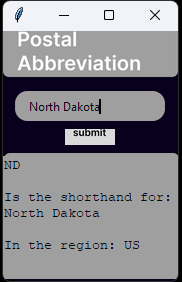
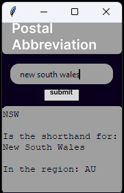

# S3abbv

A python tool, created out of my own frustration at work, to return the postal abbreviation of the given state/province. Using data that was originally downloaded as a CSV, convert a list of each relevent country's State Name/Abbreviation pairs into a python Dictionary of the same key/value pairs.

The application iterates through a dictionary of Region Codes and filepaths as key value pairs, opening each file under a specific region code to iterate through each each dictionary to create State Objects that intake each State's Name, Abbreviation, and Region. Each State object is then stored in a hash map with its full name as the input for the hasing function.

Due to the nature of hashing, you can run into issues with collision, where two separate states/entities have the same hash despite having separate keys. These are handled by turning the database entry into an array that stores each of the separate keys that share that hash. When querying the database, the application checks if the entry is a list; if it is, the app iterates through each entry and compares the formatted input with each stored key.

With the data loaded into an active database, the application awaits the users input and will respond with a formatted abbreviation for the requested state/province or an error message if none are found.

# Challenges and Takeaways

A large challenge to the text-based version of this application was its case-sensitivity in the beginning. Before creating a comprehensive parsing api for inputs, the system would not be able to find the state unless it was properly capitalized by the user. By investing more time on the back-end, I was able to simplify the user experience by ensuring all inputs that reach the database are properly formatted and capitalzied.

The tool created to answer this formatting issue was used repeatedly throughout the project, reaffirming the power of versatile and adaptable code.

With this being a first successful endeavor into GUI development in python, I ran into many roadblocks designing the UI via raw tkinter. Discovering and using tkinter-designer was incredibly useful. It allowed me to streamline the artistic design elements of the GUI and connect my comprehensively-designed API elements.

# Usage

You can double click the start.bat file on windows, or run the main file through python, as shown below:

```
python s3abbv.py
```

# Updates

02/20/2024 - I have been experimenting with hash maps in other languages and decided to try implementing one here. It uses a hashing function that finds the MOD of each character to determine its key, then places the state object at that position on the hash map.

02/21/2024 - Completed a first iteration of a GUI for this application using Tkinter, Figma, and Tkinter-Designer.





